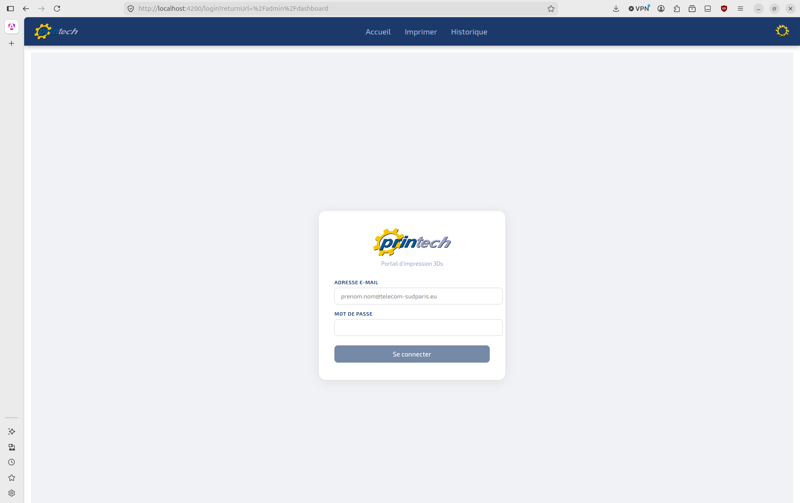
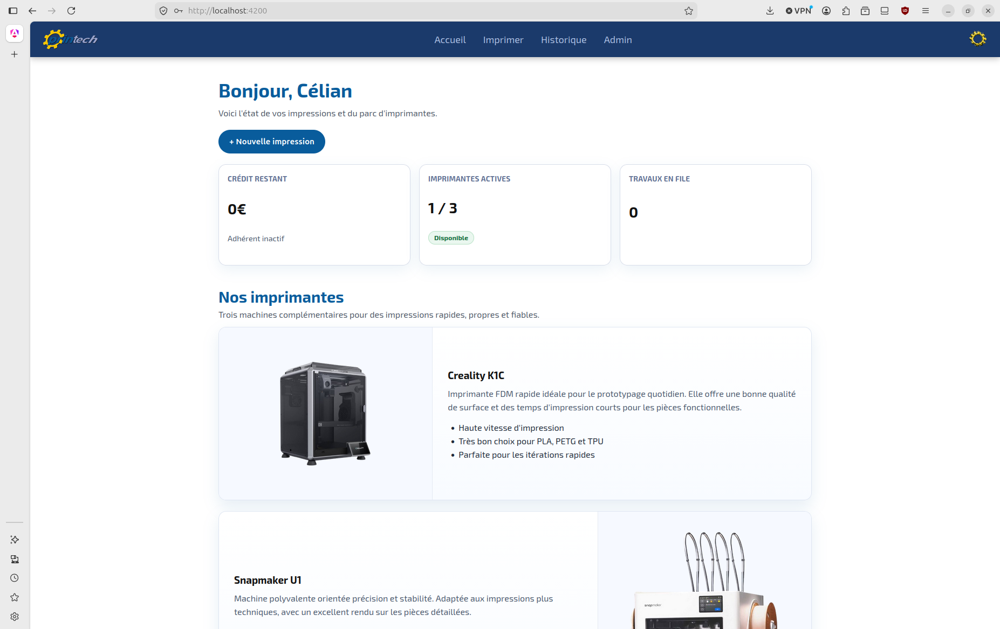
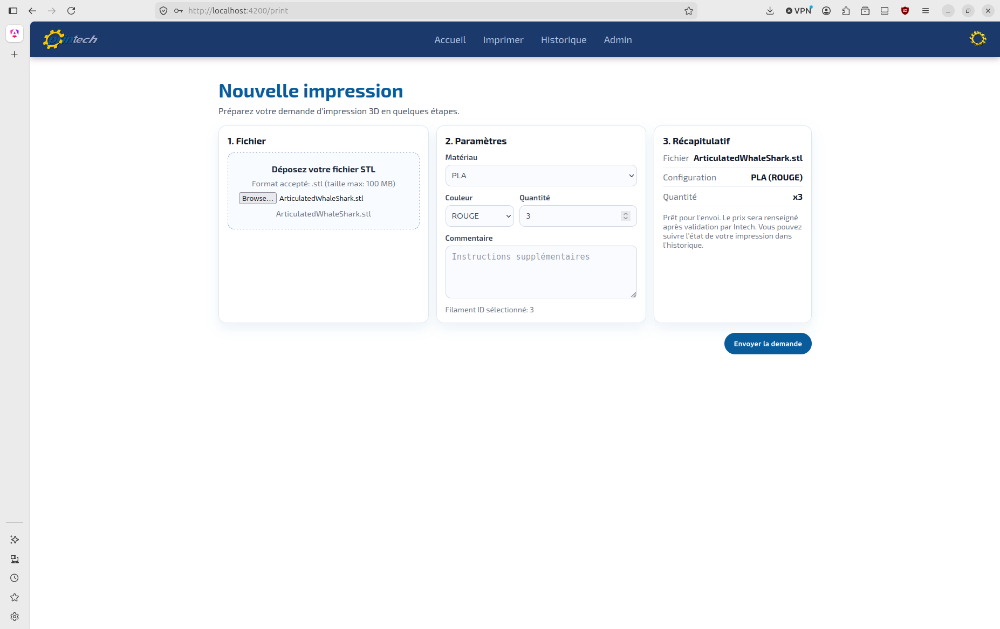
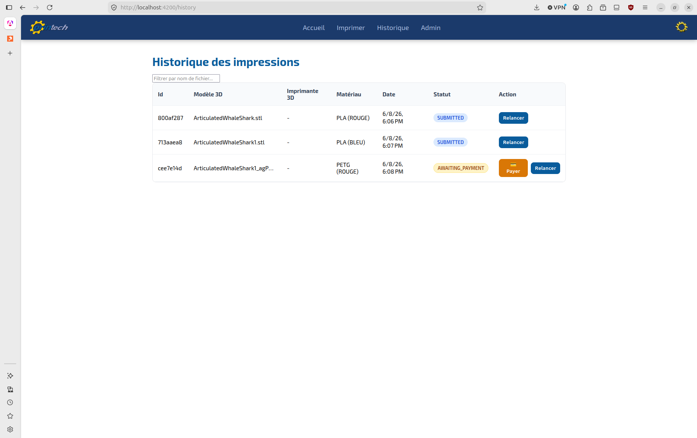
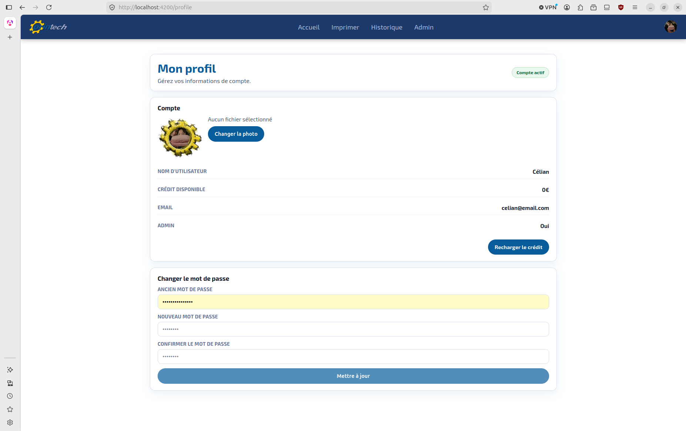
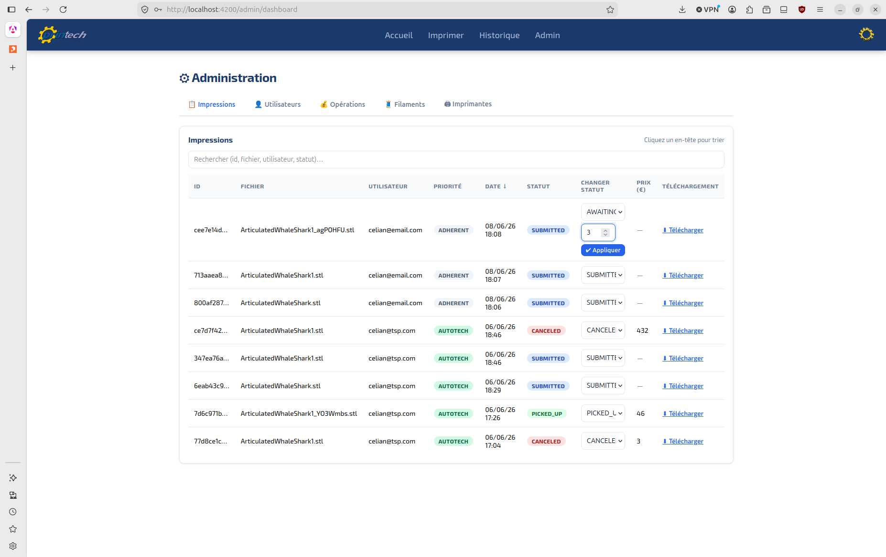
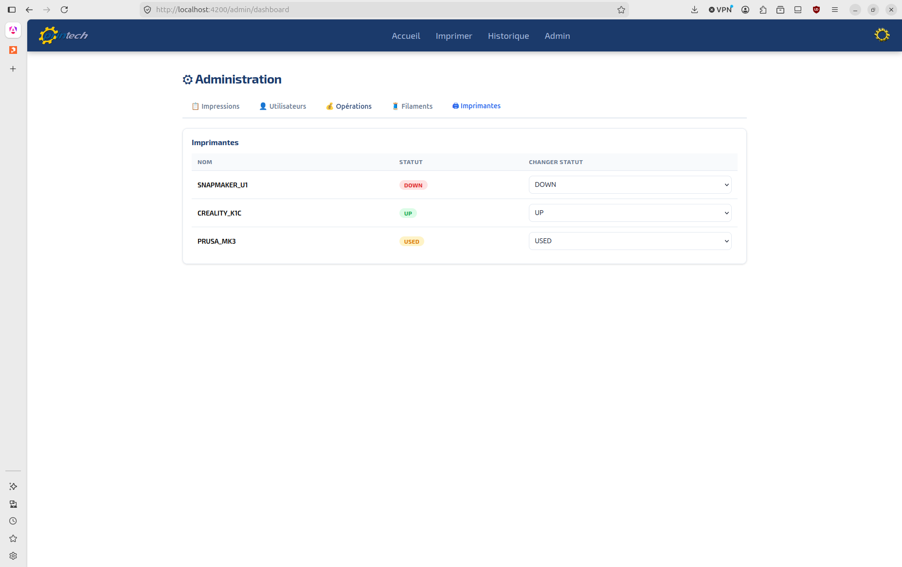
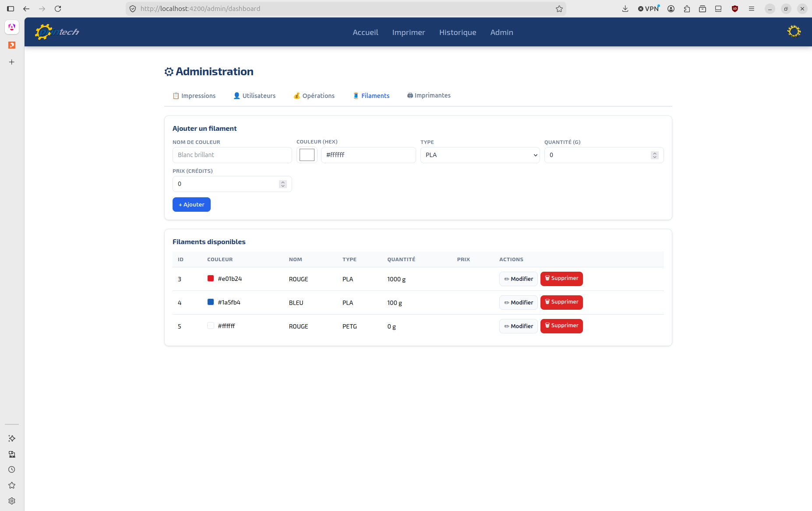
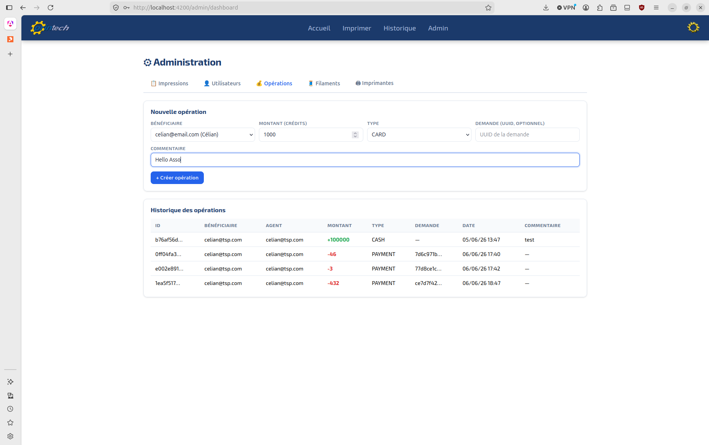
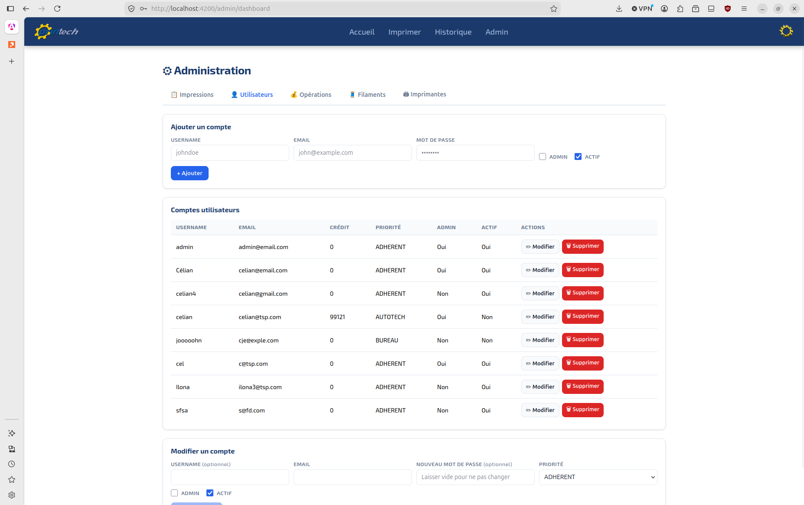

\newpage

# 1. Introduction

Depuis cette année, l'association INTech du campus rencontre des difficultés pour gérer les impressions 3D réalisées par ses membres. En effet, INTech offre désormais aux étudiants de l'école la possibilité d'imprimer leurs modèles 3D en devenant adhérents, selon le processus décrit dans la figure 1.

Le processus commence lorsqu'un étudiant trouve un modèle 3D, renomme le fichier à son nom (au format `NOM-PRENOM.stl`), puis remplit un Google Form pour s'enregistrer dans un tableur avant de lancer l'impression. Si l'étudiant n'est pas présent à la fin du travail et que l'imprimante est requise pour une autre tâche, un opérateur de l'association retire la pièce et la stocke au local en attendant son retour. À la fin du mois, la phase de facturation s'enclenche : l'opérateur consulte le tableur Google Sheets pour calculer le montant total dû, crée un lien de paiement sur **HelloAsso** et envoie la facture à l'étudiant. Si ce dernier règle sa facture sous 7 jours, l'opérateur valide la transaction dans sa comptabilité, ce qui marque le succès du processus. En revanche, s'il ne règle pas sa dette après plusieurs relances hebdomadaires et que le plafond maximal d'avertissements est atteint, l'étudiant est inscrit sur liste noire, ce qui entraîne l'échec de la procédure.

Actuellement, ce système de gestion présente plusieurs limites. Les adhérents doivent télécharger et paramétrer un logiciel de découpe (*slicer*) qui permet de transformer un modèle 3D en une série d'instructions pour les imprimantes, appelée G-code. On demande ensuite aux adhérents de charger ce G-code sur les imprimantes, de lancer les impressions, puis de remplir un Google Form en y renseignant le nom de leur fichier, le poids de l'impression et d'autres paramètres techniques.  

Ce fonctionnement implique de nombreuses étapes manuelles susceptibles d'engendrer des erreurs et de faciliter la fraude. De plus, il impose de former chaque nouvel adhérent à l'utilisation physique des machines.

C'est dans ce contexte qu'intervient le projet PrINTech, qui consiste à développer une application web dynamique afin d'automatiser la gestion des impressions 3D. Contrairement à la solution existante, ce projet s'inscrit dans une vision à long terme : il facilite le passage à l'échelle (intégration de nouvelles imprimantes ou augmentation du nombre d'utilisateurs) et permet de réduire considérablement la charge de travail du bureau de l'association.

---

\newpage
## 1.1. Terminologie

Pour faciliter la lecture de ce rapport, cette section regroupe et définit les termes techniques, les acronymes et les notions spécifiques au domaine de l'impression 3D et du développement web abordés dans ce document.

### Impression 3D et Matériaux
* **Fichier STL (`.stl`)** : Format de fichier standard en impression 3D (Stéréolithographie) représentant la géométrie de la surface d'un objet 3D sous forme de triangles.
* **Slicer (Trancheur)** : Logiciel qui découpe un modèle 3D virtuel en fines couches horizontales et génère les instructions nécessaires à l'imprimante.
* **G-code** : Langage de programmation numérique universel utilisé pour piloter les machines-outils et les imprimantes 3D.
* **Filament** : Fil de plastique en bobine servant de matière première à l'imprimante 3D pour fabriquer les objets.
* **PETG** : Type de plastique très résistant (similaire à celui des bouteilles d'eau, mais modifié), souvent utilisé pour des pièces devant supporter des chocs ou une exposition extérieure.
* **PLA (Acide Polylactique)** : Plastique d'origine végétale couramment utilisé en impression 3D.
* **Supports** : Structures temporaires imprimées en même temps que le modèle pour soutenir les parties dans le vide.

### Technologies Web & Architecture
* **Angular** : Framework côté client (Frontend) utilisé pour concevoir une interface utilisateur dynamique.
* **Django** : Framework de haut niveau basé sur Python, utilisé pour le développement de la logique métier (Backend).
* **API REST** : Style d'architecture logicielle permettant au Frontend et au Backend de communiquer via le protocole HTTP.
* **PostgreSQL** : Système de gestion de base de données relationnelle open-source.
* **Docker & Conteneurisation** : Technologie permettant d'isoler une application et ses dépendances dans un environnement virtuel appelé "conteneur".
* **Nginx & Gunicorn** : Duo de production où Nginx sert de serveur proxy inverse et Gunicorn de serveur d'application WSGI pour exécuter le code Python.

### Outils de Développement & Tests
* **Git / Git Flow** : Git est le système de contrôle de version ; Git Flow est la méthodologie qui structure la collaboration (branches `main`, `develop`, `features/`).
* **PR (Pull Request)** : Demande formelle de fusion de code soumise par un développeur pour relecture et validation.
* **uv** : Gestionnaire de paquets et d'environnements Python extrêmement rapide, écrit en Rust.
* **Playwright** : Framework de test de bout en bout (E2E) permettant de simuler le comportement d'un utilisateur réel.

\newpage
# 2. Cahier des charges

À la suite des rapports et des échanges menés avec le bureau et les membres actifs de l'association INTech, une analysis approfondie des besoins opérationnels a été réalisée. Le constat est simple : le volume croissant de demandes d'impression 3D sur le campus sature le modèle de gestion actuel, basé sur des processus manuels et des outils tiers (Google Forms, tableurs Sheets).

## 2.1. Description du sujet

Notre projet consiste en la réalisation d'une application web dynamique. Le site doit être capable d'interagir avec une base de données qu'il nous incombe d'implémenter. Cette plateforme permettra l'identification sécurisée des étudiants souhaitant imprimer des modèles 3D grâce à un système de gestion des utilisateurs, des requêtes et des files d'attente.

Cette plateforme aura pour objectifs principaux :

* **L'authentification sécurisée** des étudiants du campus souhaitant utiliser les services d'impression 3D.
* **La gestion des utilisateurs** en distinguant les rôles (adhérents, bureau, membres d'un projet) et leurs droits associés.
* **Le traitement des requêtes** afin de centraliser, suivre et historiser toutes les demandes de fabrication soumises par les élèves.
* **La gestion des crédits et de la tarification** afin de permettre le paiement de chaque impression.
* **Un espace administrateur** offrant une interface de gestion complète pour le bureau.

\newpage

## 2.2. Liste des fonctionnalités de l'application
Afin de répondre au sujet, l'application doit intégrer les fonctionnalités suivantes, classées par priorité de développement :

| ID | Fonctionnalité de l'application | Description technique | Priorité |
| :--- |:--------------| :--------------------- | :---: |
| **F01** | **Authentification** | Connexion et déconnexion. | Haute |
| **F02** | **Gestion des profils** | Affichage et modification des informations utilisateurs. | Basse |
| **F03** | **Gestion des impressions** | Flux complet d'impression 3D, du dépôt STL à la mise en file. | Haute |
| **F03-1** | **Déposer un STL** | Upload d'un fichier STL. | Haute |
| **F03-2** | **Slicer automatique** | Convertir le modèle en G-code via un slicer. | Moyenne |
| **F03-3** | **Estimation du coût** | Calculer le prix d'impression à partir des paramètres. | Basse |
| **F03-4** | **Position dans la file** | Afficher la place du travail dans la file. | Basse |
| **F03-5** | **Priorité projets INTech** | Chaque utilisateur a un rôle (adhérent, bureau, membre d'un projet) pour prioriser les impressions. | Basse |
| **F03-6** | **Crédit restant** | Afficher le crédit restant d'un utilisateur. | Basse |
| **F03-7** | **Quantité d'impressions** | Indiquer le nombre d'exemplaires à imprimer. | Basse |
| **F04** | **Espace administrateur** | Interface d'administration pour une gestion complète. | Moyenne |
| **F04-1** | **Gestion des utilisateurs** | Créer, modifier et supprimer les utilisateurs. | Haute |
| **F04-2** | **Gestion des travaux** | Créer, modifier et supprimer la file de travaux. | Moyenne |
| **F04-3** | **Reprise des erreurs** | Déclarer un travail en erreur et le remettre en file. | Moyenne |
| **F04-4** | **Gestion crédit** | Gestion des crédits des utilisateurs, incluant la recharge. | Haute |
| **F05** | **Intégrations** | SSO et notifications externes. | Optionnelle |
| **F05-1** | **Intégration CAS** | Inscription et connexion via le CAS de l'école. | Optionnelle |
| **F05-2** | **Intégration Discord** | Utiliser des webhooks pour les notifications. | Optionnelle |
| **F05-3** | **Intégration HelloAsso** | Créditer les comptes via HelloAsso. | Optionnelle |
| **F06** | **Impression technique** | Options avancées d'impression. | Optionnelle |
| **F06-1** | **Utilisation de supports** | Détecter quand l'utilisation de supports est nécessaire. | Optionnelle |
| **F06-2** | **Paramétrage du slicer** | Permettre l'upload d'un JSON de paramètres. | Optionnelle |
| **F06-3** | **Choix des matériaux** | Choisir un plastique autre que le PLA. | Optionnelle |
| **F07** | **Gestion des filaments** | Administration des filaments et du stock. | Optionnelle |
| **F07-1** | **Activation des filaments** | Activer et désactiver des filaments. | Optionnelle |
| **F07-2** | **Gestion du filament** | Gérer la quantité de filament restant. | Optionnelle |
| **F07-3** | **Gestion de consommation** | Rapport sur les quantités, crédits et montants imprimés. | Optionnelle |

---

\newpage

# 3. Conception

## 3.1. Base de données

Comme l'illustre ce schéma, lorsqu'un utilisateur (caractérisé par un rôle applicatif et un solde de crédits) souhaite fabriquer un objet, il émet une demande d'impression (*Request*). Celle-ci encapsule un fichier numérique (*File*) contenant le modèle 3D et ses paramètres de découpage au format JSON (*para_slicer*), lui-même associé à un consommable précis (*Filament*) défini par son type (PLA ou PETG) et sa couleur. La demande est ensuite affectée à une machine (*Printer*) identifiée par son modèle et son état de disponibilité. Enfin, pour éradiquer les risques de fraude et automatiser la comptabilité, chaque transaction (recharge de compte par carte/espèces ou débit/remboursement lié à une impression) est tracée par l'entité *Operation*. Cette table lie un agent du bureau à un utilisateur bénéficiaire tout en restant historiquement connectée à la *Request* d'origine.

---

\newpage

## 3.2. Exemple de schéma: Séquence de l'Authentification

Pour sécuriser l'accès aux ressources de la plateforme et garantir que chaque étudiant interagit uniquement avec ses propres données, le projet implémente un flux d'authentification basé sur des jetons d'accès (JWT) via la bibliothèque Django REST Framework SimpleJWT représenté dans le schéma ci-dessous. Ce mécanisme élimine les failles de sécurité de l'ancien système et permet une communication fluide entre le Frontend Angular et l'API Backend.

---

\newpage

## 3.3. Processus d'impression 3D avec PrIntech

### Description du processus d'impression 3D

Le processus débute lorsqu'un étudiant dépose un modèle 3D sur la plateforme (**F03-1 : Déposer un STL**). Une fois la requête enregistrée dans l'interface d'administration (**F04-2 : Gestion des travaux**), le système évalue automatiquement les ressources nécessaires. Il vérifie d'une part la quantité de matière disponible (**F07-2 : Gestion du filament**) et d'autre part le montant estimé de l'impression (**F03-3 : Estimation du coût**) par rapport aux ressources financières de l'utilisateur (**F03-6 : Crédit restant**). Si le plastique est manquant ou indisponible, la demande est suspendue. Si l'utilisateur ne dispose pas de fonds suffisants, l'application le redirige vers le module externe afin de renflouer son compte (**F05-3 : Intégration HelloAsso**). 

Dès que ces vérifications sont validées, le travail rejoint la file d'attente informatique et l'opérateur lui attribue une machine disponible (**F04-2 : Gestion des travaux**), tout en prenant en compte le rôle de l'utilisateur pour la gestion des priorités (**F03-5 : Priorité projets INTech**). L'application procède alors au prélèvement des fonds requis sur le compte de l'étudiant (**F04-4 : Gestion crédit**), met à jour le statut informatique de l'imprimante, et l'opérateur lance physiquement la fabrication de la pièce (**F03 : Gestion des impressions**). À la fin du cycle, deux situations peuvent se présenter :
* **En cas de succès :** l'opérateur valide la fin de la tâche (**F04-2 : Gestion des travaux**), l'imprimante repasse informatiquement à l'état disponible, le stock de plastique restant est ajusté (**F07-2 : Gestion du filament**) et une alerte automatisée est envoyée à l'étudiant (**F05-2 : Intégration Discord**) pour l'inviter à récupérer sa pièce.
* **En cas d'échec :** l'opérateur déclare l'avarie sur l'interface (**F04-3 : Reprise des erreurs**), libérant immédiatement la machine. Le système réajuste alors automatiquement le solde de l'étudiant (**F04-4 : Gestion crédit**) tout en envoyant une notification Discord pour l'avertir du problème (**F05-2 : Intégration Discord**).

---

\newpage

# 4. Réalisation et choix techniques

## 4.1. Choix des technologies

Les technologies disponibles pour développer une application web sont nombreuses. Pour effectuer notre sélection, nous avons d'abord examiné les outils capables de répondre à notre cahier des charges, avant de nous appuyer sur les technologies avec lesquelles les membres de notre équipe avaient déjà de l'expérience. Sur la base de ces critères, nous avons sélectionné la pile technique (*stack*) suivante. 

Pour le frontend :
- **Angular** : Pour la réalisation de l'interface utilisateur. Angular s'appuie sur une architecture en composants et sur le langage **TypeScript**, apportant un typage fort et une structure rigoureuse.

Pour le backend :
- **Django (Python)** : Utilisé pour développer le cœur de la logique métier et l'API REST (via *Django REST Framework*).
- **uv** : Afin de gérer nos bibliothèques et nos versions de Python, nous avons utilisé `uv`. C'est un équivalent de Poetry, mais optimisé car implémenté en Rust. Il est nécessaire de préfixer nos commandes par `uv run` afin que le processus s'exécute dans l'environnement dédié.
- **Swagger (OpenAPI)** : Intégré à notre backend pour la documentation et le test de l'API REST. Swagger génère automatiquement une interface web interactive à partir des routes Django. Cela permet aux développeurs frontend de comprendre instantanément les points de terminaison (*endpoints*), les paramètres attendus et les réponses de l'API, facilitant grandement la communication et l'intégration.
- **PostgreSQL** : Ce système de gestion de base de données relationnelle (SGBDR) open-source a été retenu pour sa robustesse, sa conformité ACID et sa gestion fine des transactions financières (crédits, remboursements, opérations). Sa capacité à indexer efficacement les données structurées garantit des performances optimales lors de la montée en charge du système et du suivi des files d'attente.
- **Klipper** : Firmware communautaire utilisé pour remplacer le micrologiciel constructeur des imprimantes.
- **Moonraker** : Outil qui expose les API JSON-RPC de Klipper sous forme d'API REST.
- **FDM Monster** : Cet orchestrateur open-source centralise la gestion d'une flotte d'imprimantes 3D. Connecté aux différentes instances Moonraker, il permet de piloter le parc, de centraliser le contrôle des machines et de gérer globalement les files d'attente d'impression.

### Tests, Validation et Qualité Logicielle
- **Tests natifs Django (TestCase)** : Intégrés directement au backend, le framework de test unitaire et d'intégration natif de Django permet de sécuriser l'intégrité de la base de données lors des transactions critiques. Ils valident de manière isolée les calculs de prix, l'exactitude des débits et remboursements, le respect des rôles pour la gestion des priorités, ainsi que les transitions de statut des requêtes d'impression (du dépôt initial jusqu'à la mise en file).
- **Playwright** : Framework moderne retenu pour l'automatisation des tests de bout en bout (*End-to-End*). Complémentaire aux tests Django, Playwright nous permet de simuler le parcours complet d'un utilisateur sur un navigateur réel de manière isolée.

### Conteneurisation et Infrastructure
- **Docker & Docker Compose** : Afin de partitionner logiquement les différentes couches applicatives (Frontend, Backend, Base de données), nous avons conteneurisé chaque service. Technologie incontournable en milieu professionnel, Docker garantit que l'application s'exécute de manière strictement identique sur les machines de développement et sur le serveur de production, simplifiant ainsi la configuration de l'infrastructure.
- **Nginx & Gunicorn** : Pour le déploiement en production, **Gunicorn** fait office de serveur d'application WSGI, chargé d'exécuter le code Python/Django en gérant efficacement les requêtes concurrentes via un système de processus de travail (*workers*). Il est placé derrière **Nginx**, configuré comme un proxy inverse (*reverse proxy*). Nginx assure la sécurité globale, gère les certificats SSL/TLS (HTTPS), sert directement les fichiers statiques ou médias lourds (comme les fichiers STL stockés) et distribue la charge vers le backend.

### Outils de développement et de collaboration
* **Visual Studio Code (VS Code)** : Choisi comme environnement de développement intégré (IDE) principal par l'équipe.
* **Git & GitFlow** : Pour la gestion de version, nous utilisons **Git** hébergé sur **GitHub**. Afin d'organiser le travail collaboratif sans bloquer la production, nous appliquons la méthodologie **GitFlow** (branches `main`, `develop`, et `feature/` isolées).
* **Discord & Webhooks GitHub** : Discord est notre outil de communication principal. À chaque fois qu'un développeur pousse du code (*push*) ou ouvre une demande de fusion (*pull request*), une notification automatique est envoyée dans un salon dédié sur Discord, facilitant le suivi de l'avancement.

--- 

\newpage

## 4.2. Réalisation

Pour la conteneurisation, il a fallu configurer un fichier `docker-compose.yaml` afin de déployer un conteneur PostgreSQL configuré sur le bon port. Enfin, pour la mise en commun du code, l'utilisation de Git Flow a permis de définir un cadre de travail professionnel clair.

Afin de valider l'expérience utilisateur et de documenter le rendu final de notre application PrINTech, cette section presents les principales interfaces développées, divisées entre l'espace adhérent (client) et l'espace d'administration (opérateur).

\newpage

### 4.2.1. Espace Étudiant et Demandes d'Impression

* **Interface de Connexion** : Cette interface épurée permet l'authentification sécurisée des utilisateurs (Fonctionnalité **F01**).  
  

* **Page d'Accueil** : Le tableau de bord principal de l'étudiant. Il offre une vue d'ensemble claire sur ses activités courantes et met en valeur son solde (Fonctionnalité **F03-6 : Crédit restant**).  
  

* **Dépôt d'une demande d'impression** : Formulaire intuitif dédié au dépôt des fichiers 3D (Fonctionnalité **F03-1 : Déposer un STL**). L'étudiant peut y téléverser son modèle, spécifier la quantité d'exemplaires souhaitée (**F03-7**) ainsi que le choix des matériaux avant l'envoi au serveur.  
  

* **Historique des travaux** : Cette vue liste l'intégralité des commandes passées par l'étudiant reprenant la date de dépôt, le type de projet et leur statut en direct (Fonctionnalité **F03-4 : Position dans la file**).  
  

* **Profil** : Permet l'affichage et modification des informations utilisateurs: photo de profil, mot de passe (Fonctionnalité **F02 : Gestion des profils**).  
  

---

\newpage

### 4.2.2. Espace Administration et Gestion des Opérations

Réservé aux membres du bureau et aux opérateurs de l'association INTech (Fonctionnalité **F04**), cet espace permet un pilotage complet du service et du parc matériel.

* **Gestion de la file des travaux** : Interface maîtresse de l'opérateur (Fonctionnalité **F04-2 : Gestion des travaux**). Elle centralise les fichiers `.stl` soumis, permet d'assigner manuellement ou automatiquement une imprimante libre et d'appliquer la tarification calculée.  
  

\newpage

* **Suivi du parc d'imprimantes** : Écran de supervision du statut des machines connectées. L'administrateur peut visualiser instantanément quelles machines sont disponibles (`UP`), occupées (`USED`) ou hors service (`DOWN`).  
  

* **Gestion des stocks de consommables** : Vue dédiée au contrôle des stocks de plastique (Fonctionnalité **F07 : Gestion des filaments**). Elle permet d'enregistrer les nouvelles bobines et de surveiller la quantité de matière restante en grammes (**F07-2**).  
  

* **Suivi financier et des transactions** : Historique financier de la plateforme (Fonctionnalité **F04-4 : Gestion crédit**). Cet écran liste de manière chronologique tous les débits, les rechargements HelloAsso fructueux ainsi que les remboursements automatiques émis suite à une erreur d'impression.  
  

* **Administration des comptes utilisateurs** : Interface de modération des profils (Fonctionnalité **F04-1**). Elle permet également de modifier les rôles (adhérents, bureau, membres d'un projet) (**F03-5**).  
  
  
  ---

\newpage

# 5. Validation et tests

Pour garantir la robustesse de l'application PrINTech, nous avons mis en place une stratégie de tests automatisés. L'effort principal a été concentré sur la validation fonctionnelle du backend (Django), complété par des mécanismes de tests d'intégration et d'interface (Playwright).

## 5.1. Tests Backend (Django)

Le backend constituant le cœur logique et financier de notre application, nous avons conçu une suite rigoureuse de tests unitaires et d'intégration à l'aide du framework de test de *Django REST Framework* (`APITestCase`). Les tests se trouvent dans le fichier `PrINTech-Back/back/apps/api/tests.py` et couvrent les fonctionnalités clés du système :

### 5.1.1. Fonctionnalités validées par les tests automatiques :

* **F01 (Authentification) & Sécurisation des routes** : 
  * Nous validons la génération et le rejet des requêtes selon la validité des jetons d'accès JWT (`test_missing_token`, `test_unauthenticated_cannot_upload`).
  * L'étanchéité des droits est testée systématiquement : un utilisateur standard reçoit une erreur `HTTP_403_FORBIDDEN` lorsqu'il tente d'accéder aux routes d'administration (`test_regular_user_cannot_access_admin_user_endpoints`, `test_user_cannot_access_admin_endpoint`, `test_admin_access`).

* **F02 (Gestion des profils)** :
  * Les tests vérifient les contraintes de modification de profil, comme le changement sécurisé de mot de passe (`test_change_password_wrong_old_password`), ainsi que la gestion stricte de la photo de profil (`test_upload_profile_picture`, `test_delete_profile_picture_when_none_exists`).
  * L'isolation des requêtes est certifiée par le test `test_no_access_other_user_request` : un utilisateur connecté ne peut en aucun cas interroger, modifier ou lister les demandes d'un autre étudiant, prévenant toute fuite de données.

* **F03 (Gestion des impressions) & F03-7 (Quantité)** :
  * Le flux complet de soumission est validé par `test_create_request`. 
  * Bien que les tests d'interface automatisés n'aient pas pu valider le calcul de consommation frontend, la logique backend est blindée : l'API calcule et valide le coût total ainsi que la cohérence des paramètres avant toute mise en file.

* **F03-5 (Priorité projets INTech)** :
  * Le test critique `test_admin_request_list_priority_sorting` certifie que l'API trie et ordonne automatiquement les demandes en attente selon la hiérarchie stricte des rôles : `BUREAU` (0) > `ROBOTECH` (1) > `ADHERENT` (2).
  * Le test `test_default_role_is_adherent` assure qu'un nouvel utilisateur est assigné par défaut au rôle le plus restrictif.

* **F03-6 (Crédit restant) & F04-4 (Gestion crédit)** :
  * Les scénarios de paiement et de remboursement sont entièrement automatisés. `test_pay_request_success` valide le débit immédiat du crédit de l'étudiant au prorata du prix fixé, tandis que `test_cancel_request_with_refund` s'assure du recrédit automatique du solde en cas d'annulation.
  * Les garde-fous contre la fraude sont vérifiés par `test_user_cannot_update_credit_manually` (un utilisateur ne peut pas modifier son solde lui-même) et `test_pay_request_insufficient_funds` (blocage de la transaction si le solde est insuffisant).

* **F04-1 (Gestion des utilisateurs) & F04-2 (Gestion des travaux)** :
  * Les privilèges des opérateurs du bureau sont testés pour la modification des rôles applicatifs (`test_admin_can_modify_user_role`) et le changement d'état manuel des imprimantes (`test_admin_update_printer_status`).
  * La cohérence des transitions d'états de la file d'attente est gérée par `test_staff_change_status_auto` et `test_staff_must_set_price_for_awaiting_payment`, forçant l'attribution d'un prix avant le passage au paiement.

* **F07-2 (Gestion du filament)** :
  * L'administration des consommables est sécurisée par les tests `test_admin_create_filament` et `test_admin_can_update_quantity`, garantissant la mise à jour fiable des stocks de plastique en base de données.
---

## 5.2. Tests d'Interface (Playwright) et Validation Frontend

Pour la partie émergée de l'iceberg (le Frontend), l'objectif initial intégrait le déploiement de tests de bout en bout (E2E) via l'outil **Playwright**. 

Cependant, comme évoqué dans notre bilan de projet (Section 6.1.3), le retard accumulé sur l'apprentissage d'Angular et la complexité de l'interfaçage asynchrone ont limité la couverture finale de ces tests E2E. 

## 5.2. Tests Manuels et Validation Fonctionnelle

Pour pallier la couverture limitée des tests automatisés sur Playwright consécutive aux retards de développement, l'équipe a mis en place une **campagne rigoureuse de tests manuels**. Structurée autour d'un cahier de recette, cette approche a permis de confronter l'interface Angular aux règles métiers implémentées sur le backend Django.

### 5.2.1. Scénarios validés et cahier de recette
Les tests ont été exécutés de bout en bout en simulant les deux rôles applicatifs clés de la plateforme :

* **Parcours Étudiant (Interface Client)** :
  * **F01 (Authentification)** : Validation de la connexion, de la déconnexion et de la persistance du jeton JWT.
  * **F03-1 & F03-7 (Dépôt et Quantité)** : Téléversement réussi de fichiers `.stl` et spécification du nombre d'exemplaires.
  * **F03-6 (Crédit restant)** : Vérification de l'affichage dynamique du solde de l'étudiant et du blocage de l'interface en cas de fonds insuffisants.
  * **F06-3 (Matériaux)** : Sélection et transmission correcte du type de consommable (PLA / PETG).

* **Parcours Bureau / Opérateur (Espace Administration)** :
  * **F04-1 & F03-5 (Utilisateurs et Priorités)** : Modification des rôles (adhérents, bureau, projets) et vérification de l'impact visuel sur la hiérarchie des comptes.
  * **F04-2 (Gestion des travaux)** : Assignation manuelle d'une imprimante à un travail de la file et mise à jour de son statut (`UP`, `USED`, `DOWN`).
  * **F04-4 (Gestion crédit)** : Simulation de rechargements de comptes et de débits manuels.
  * **F07-2 & F07-3 (Consommation)** : Décrémentation manuelle des stocks de filament en grammes et génération des rapports de consommation.

### 5.2.2. Bilan de la validation manuelle
Bien que cette méthode soit plus chronophage qu'une suite de tests E2E automatisée, elle s'est avérée indispensable pour assurer la livraison. 
\newpage

# 6. Bilan du projet

## 6.1. Plannings

Le projet a accumulé d'importants retards, notamment en raison de la participation de certains membres de l'équipe à la Coupe de France de Robotique dans le cadre du projet GATE. Nous avons également sous-estimé la courbe d'apprentissage des technologies utilisées (Angular et Django). Le fait que tous les membres ne soient pas polyvalents sur le Frontend et le Backend a créé des complications de répartition. De plus, la communication avec les imprimantes (confiée à Arnaud) n'a pas pu être finalisée, ce qui a temporairement limité le périmètre d'automatisation du projet.

### 6.1.1. Planning prévisionnel

---

\newpage

### 6.1.2. Planning final

---

\newpage

### 6.1.3. Commentaires

- **Choix du planning prévisionnel** :
  - Angular étant appris en parallèle du projet, le développement Front n'a débuté qu'en février.
  - Django étant mieux maîtrisé, son exécution a été plus rapide. La partie Moonraker/Klipper représentait la plus grande incertitude technique.
  - La phase 3 a été la plus longue en raison de l'apprentissage en cours.

- **Comparaison au planning réel** :
  - Le projet a accumulé du retard en raison d'échéances académiques conflictuelles (projets GATE, partiels) et d'une sous-estimation de la complexité de certaines tâches.
  - En réponse, nous avons réévalué le périmètre de notre projet afin de nous concentrer sur les fonctionnalités indispensables requises par le cahier des charges (les tests E2E ayant été mis de côté pour le moment).
  - Ce retard n'est pas une fatalité : compte tenu de l'utilité concrète du projet, le développement sera poursuivi bien au-delà de la date de rendu académique.

---

\newpage

## 6.2. Plan de charges

L'écart le plus marquant entre notre planification et la réalité réside dans la courbe d'apprentissage d'Angular et de Django, qui s'est révélée beaucoup plus longue et abrupte que prévu. N'ayant pas de compétences approfondies préalables sur ces frameworks, l'assimilation des concepts clés a nécessité un investissement temporel important.

### 6.2.1. Plan de charges prévisionnel et final

---

\newpage

### 6.2.3. Commentaires

Nous avons optimisé le temps imparti. Celui-ci nous a permis de nous former non seulement sur les technologies auxquelles nous étions affectés, mais aussi de comprendre l'ensemble du code (Front et Back).

Nous sommes ainsi parvenus à valoriser nos compétences grâce à une compréhension plus fine des abstractions techniques. Alors que Célian ne connaissait pas Django au démarrage du projet, qu'Adam débutait sur Angular et que Yanis était focalisé sur le Backend, nous sommes aujourd'hui tous en mesure de comprendre et de corriger le code de nos pairs à travers le système de Pull Requests sur Git.

---

\newpage

## 6.3. Difficultés rencontrées

Malgré un produit final assez satisfaisant, le projet a été jalonné de difficultés qui nous ont poussés à adapter notre champ d'action :

- La mise en commun du travail a été plus complexe que prévu, notamment lors de l'instauration des PR qui ont parfois perturbé le flux Git Flow classique.
- Les retards accumulés ont entamé l'efficacité globale de l'équipe malgré un démarrage rapide.
- **L'exploitation des API des imprimantes 3D** : Notre objectif initial était de relier directement les imprimantes à l'application via le logiciel FDM Monster. Cependant, cette configuration s'est révélée difficile en raison des systèmes propriétaires des machines. De plus, les machines étant hautement sollicitées sur le campus, nous avons temporairement configuré la plateforme pour qu'un administrateur valide et lance chaque impression manuellement. Nous continuons néanmoins à travailler sur l'automatisation complète de ce processus.

### 6.3.1 Fonctionnalités réalisées ou non

| ID | Fonctionnalité de l'application | Description technique | Priorité | Statut |
| :--- | :--- | :--- | :---: | :---: |
| **F01** | **Authentification** | Connexion et déconnexion. | Haute | **Réalisé** |
| **F02** | **Gestion des profils** | Affichage et modification des informations utilisateurs. | Basse | **Réalisé** |
| **F03** | **Gestion des impressions** | Flux complet d'impression 3D, du dépôt STL à la mise en file. | Haute | **Réalisé** |
| **F03-1** | **Déposer un STL** | Upload d'un fichier STL. | Haute | **Réalisé** |
| **F03-2** | **Slicer automatique** | Convertir le modèle en G-code via un slicer. | Moyenne | **Non réalisé** |
| **F03-3** | **Estimation du coût** | Calculer le prix d'impression à partir des paramètres. | Basse | **Non réalisé** |
| **F03-4** | **Position dans la file** | Afficher la place du travail dans la file. | Basse | **Non réalisé** |
| **F03-5** | **Priorité projets INTech** | Rôle dédié pour prioriser les impressions. | Basse | **Réalisé** |
| **F03-6** | **Crédit restant** | Afficher le crédit restant d'un utilisateur. | Basse | **Réalisé** |
| **F03-7** | **Quantité d'impressions** | Indiquer le nombre d'exemplaires à imprimer. | Basse | **Réalisé** |
| **F04** | **Espace administrateur** | Interface d'administration pour une gestion complète. | Moyenne | **Réalisé** |
| **F04-1** | **Gestion des utilisateurs** | Créer, modifier et supprimer les utilisateurs. | Haute | **Réalisé** |
| **F04-2** | **Gestion des travaux** | Créer, modifier et supprimer la file de travaux. | Moyenne | **Réalisé** |
| **F04-3** | **Reprise des erreurs** | Déclarer un travail en erreur et le remettre en file. | Moyenne | **Non réalisé** |
| **F04-4** | **Gestion crédit** | Gestion des crédits des utilisateurs (recharge). | Haute | **Réalisé** |
| **F05** | **Intégrations** | SSO et notifications externes. | Optionnelle | **Non réalisé** |
| **F05-1** | **Intégration CAS** | Inscription et connexion via le CAS de l'école. | Optionnelle | **Non réalisé** |
| **F05-2** | **Intégration Discord** | Utiliser des webhooks pour les notifications. | Optionnelle | **Non réalisé** |
| **F05-3** | **Intégration HelloAsso** | Créditer les comptes via HelloAsso. | Optionnelle | **Non réalisé** |
| **F06** | **Impression technique** | Options avancées d'impression. | Optionnelle | **Non réalisé** |
| **F06-1** | **Utilisation de supports** | Détecter la nécessité de supports. | Optionnelle | **Non réalisé** |
| **F06-2** | **Paramétrage du slicer** | Permettre l'upload d'un JSON de paramètres. | Optionnelle | **Non réalisé** |
| **F06-3** | **Choix des matériaux** | Choisir un plastique autre que le PLA. | Optionnelle | **Réalisé** |
| **F07** | **Gestion des filaments** | Administration des filaments et du stock. | Optionnelle | **Réalisé** |
| **F07-1** | **Activation des filaments** | Activer et désactiver des filaments. | Optionnelle | **Non réalisé** |
| **F07-2** | **Gestion du filament** | Gérer la quantité de filament restant. | Optionnelle | **Réalisé** |
| **F07-3** | **Gestion de consommation** | Rapport sur quantités, crédits et montants. | Optionnelle | **Réalisé** |

---

\newpage

# 7. Conclusion et perspectives

Malgré les obstacles rencontrés, notre projet a abouti à une application web fonctionnelle, conforme aux critères essentiels fixés par notre cahier des charges.

À long terme, nous souhaiterions peaufiner ce projet au-delà du cadre du livrable académique, que ce soit par la reprise du code par un autre groupe de projet informatique, ou directement par la maintenance applicative assurée par l'association INTech elle-même. La prochaine étape majeure consistera à déployer l'application en production, par exemple sur une machine virtuelle fournie par l'association MiNET, afin qu'elle devienne l'outil quotidien de l'association.

Sur le plan personnel, ce projet s'est révélé extrêmement enrichissant pour de futurs ingénieurs. Il nous a permis de manipuler des technologies et des outils professionnels tout en répondant à un besoin concret du campus. Cette expérience précieuse pour des futurs projet surtout dans le web. Enfin, au-delà de la technique, cette expérience nous a confrontés aux réalités de la gestion de projet en équipe (gestion des retards, coordination du code), ce qui constituera un atout indéniable pour nos futurs projets professionnels.

---