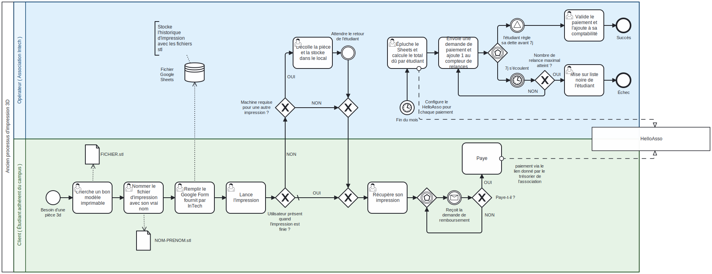
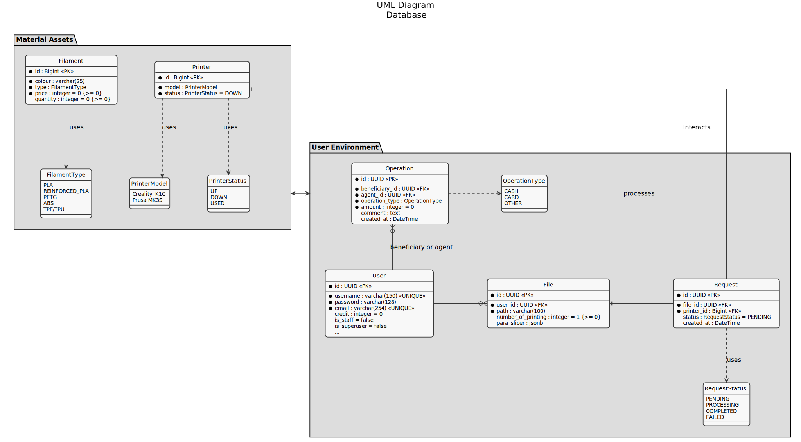
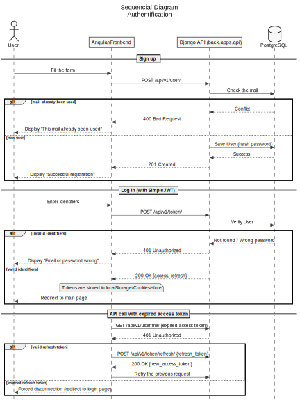
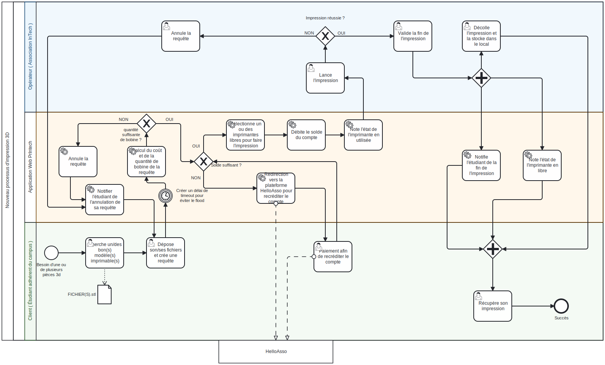
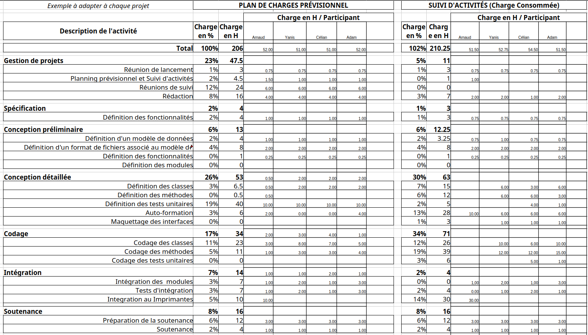

\newpage

# 1. Introduction

Depuis cette année, l'association INTech du campus rencontrait des difficultés de gestion des impressions 3D faites par les membres. En effet, depuis cette année, INTech offre aux membres du campus la possibilité d'imprimer leur modèle 3D en devenant adhérents suivant le processus décrit dans la figure 1.
\newline
Le processus commence lorsqu'un étudiant trouve un modèle 3D, le renomme à son nom (au format `NOM-PRENOM.stl`) et remplit un Google Form pour s'enregistrer dans un tableur, avant de lancer l'impression. 
Si l'étudiant n'est pas présent à la fin du travail et que l'imprimante est requise pour une autre tâche, un opérateur de l'association retire la pièce et la stocke au local jusqu'au retour de l'étudiant qui vient ensuite la récupérer. 
À la fin du mois, la phase de facturation s'enclenche : l'opérateur consulte le tableur Google Sheets pour calculer le montant total dû, crée un lien de paiement sur **HelloAsso** et envoie la facture à l'étudiant. 
Si ce dernier paie dans les 7 jours, l'opérateur valide la transaction dans sa comptabilité, ce qui valide le succès du processus ; en revanche, s'il ne règle pas sa dette après plusieurs relances de 7 jours et que le plafond maximal d'avertissements est atteint, l'étudiant est inscrit sur liste noire, ce qui entraîne l'échec de la procédure.
\newline
Actuellement, le système de gestion possède des problèmes. Les adhérents doivent télécharger et paramétrer un logiciel appelé slicer qui permet de transformer un modèle 3D en série d'instructions pour les imprimantes 3D, appelé G-code. On demande ensuite aux adhérents de charger le G-code sur les imprimantes, de lancer les impressions et ensuite de remplir un Google Form avec le nom de leur fichier, le poids de l'impression et d'autres paramètres.  
\newline
Ce système implique beaucoup d'étapes manuelles qui peuvent mener à des erreurs et rendre la fraude facile. Il faut aussi former tout le monde qui devient adhérent à l'utilisation des imprimantes.

Intervient alors le projet PrINTech consistant au développement d'une application web dynamique qui permette une gestion des impressions 3D de manière automatique.
\newline
Contrairement à la solution existante, ce projet a une vision plus long terme et facilite l'expansion à plus d'imprimantes ou de personnes et permet de réduire la charge de travail du bureau.

---

\newpage
## 1.1. Terminologie

Pour faciliter la lecture de ce rapport, cette section regroupe et définit les termes techniques, les acronymes et les notions spécifiques au domaine de l'impression 3D et du développement web abordés dans ce document.

### Impression 3D et Matériaux
* **Fichier STL (`.stl`)** : Format de fichier standard en impression 3D (Stéréolithographie). Il représente la géométrie de la surface d'un objet 3D sous forme de triangles.
* **Slicer (Trancheur)** : Logiciel qui découpe un modèle 3D virtuel en fines couches horizontales et génère les instructions nécessaires à l'imprimante.
* **G-code** : Langage de programmation numérique universel utilisé pour piloter les machines-outils et les imprimantes 3D ($X$, $Y$, $Z$).
* **Filament** : Le fil de plastique en bobine qui sert de "matière première" à l'imprimante 3D pour fabriquer les objets.
* **PETG** : Un type de plastique très résistant (le même que celui des bouteilles d'eau, mais modifié), souvent utilisé pour des pièces qui doivent supporter des chocs ou rester en extérieur.
* **PLA (Acide Polylactique)** : Plastique d'origine végétale couramment utilisé en impression 3D.
* **Supports** : Structures temporaires imprimées en même temps que le modèle.

### Technologies Web & Architecture
* **Angular / AngularJS** : Framework côté client (Frontend) utilisé pour concevoir une interface utilisateur dynamique.
* **Django** : Framework de haut niveau basé sur Python, utilisé pour le développement de la logique métier (Backend).
* **API REST** : Style d'architecture logicielle permettant au Frontend et au Backend de communiquer via le protocole HTTP.
* **PostgreSQL** : Système de gestion de base de données relationnelle open-source.
* **Docker & Conteneurisation** : Technologie permettant d'isoler une application et ses dépendances dans un environnement virtuel appelé "conteneur".
* **Nginx & Gunicorn** : Duo de production où Nginx sert de serveur proxy inverse et Gunicorn de serveur d'application WSGI pour exécuter le code Python.

### Outils de Développement & Tests
* **Git / Git Flow** : Git est le système de contrôle de version ; Git Flow est la méthodologie qui structure la collaboration (branches `main`, `develop`, `features/`).
* **PR (Pull Request)** : Demande formelle de fusion de code soumise par un développeur pour relecture et validation.
* **uv** : Gestionnaire de paquets et d'environnements Python extrêmement rapide écrit en Rust.
* **Playwright** : Framework de test de bout en bout (E2E) permettant de simuler le comportement d'un utilisateur réel.

/newpage
# 2. Cahier des charges

À la suite des rapports et des échanges menés avec le bureau et les membres actifs de l'association INTech, une analyse approfondie des besoins opérationnels a été réalisée. Le constat est simple : le volume croissant de demandes d'impression 3D sur le campus sature le modèle de gestion actuel, basé sur des processus manuels et des outils tiers (Google Forms, tableurs Sheets).

## 2.1. Description du sujet

Notre projet consiste en la réalisation d'une Application Web dynamique. C'est-à-dire que le site doit être capable d'intéragir avec une base de donnée qu'on doit aussi implémenter. Ce site web permettra alors l'identification sécurisé des étudiants voulant imprimer des modèles 3D avec un système de gestion d'utilisateurs, de requêtes, et de gestion de queues.
Cette plateforme aura pour objectifs principaux :

* **L'authentification sécurisée** des étudiants du campus souhaitant utiliser les services d'impression 3D.
* **La gestion des utilisateurs** en distinguant les rôles (adhérents, bureau, membre d'un projet) et leurs droits associés.
* **Le traitement des requêtes** afin de centraliser, suivre et historiser toutes les demandes de fabrication soumises par les élèves.
* **La gestion des crédits et de la tarification** afin de permettre de payer chaque impression
* **Espace administrateur** Interface d'administration pour une gestion complète

\newpage

## 2.2. Liste des fonctionnalités de l'application
Afin de répondre au sujet, l'application doit intégrer les fonctionnalités suivantes, classées par priorité de développement :

| ID | Fonctionnalité de l'application | Description technique | Priorité |
| :--- |:--------------| :--------------------- | :---: |
| **F01** | **Authentification**            | Connexion et déconnexion. | Haute |
| **F02** | **Gestion des profils**         | Affichage et modification des informations utilisateurs. | Basse |
| **F03** | **Gestion des impressions**     | Flux complet d'impression 3D, du dépôt STL à la mise en file. | Haute |
| **F03-1** | **Déposer un STL**              | Upload d'un fichier STL. | Haute |
| **F03-2** | **Slicer automatique**          | Convertir le modèle en G-code via un slicer. | Moyenne |
| **F03-3** | **Estimation du coût**          | Calculer le prix d'impression à partir des paramètres. | Basse |
| **F03-4** | **Position dans la file**       | Afficher la place du travail dans la file. | Basse |
| **F03-5** | **Priorité projets INTech**     | Chaque utilisateur à un rôle (adhérents, bureau, membre d'un projet) pour priiser  les impressions. | Basse |
| **F03-6** | **Crédit restant**              | Afficher le crédit restant d'un utilisateur. | Basse |
| **F03-7** | **Quantité d'impressions**      | Indiquer le nombre d'exemplaires à imprimer. | Basse |
| **F04** | **Espace administrateur**       | Interface d'administration pour une gestion complète. | Moyenne |
| **F04-1** | **Gestion des utilisateurs**    | Créer, modifier et supprimer les utilisateurs. | Haute |
| **F04-2** | **Gestion des travaux**         | Créer, modifier et supprimer la file de travaux. | Moyenne |
| **F04-3** | **Reprise des erreurs**         | Déclarer un travail en erreur et le remettre en file. | Moyenne |
| **F04-4** | **Gestion crédit**              | Gestion des crédits des utilisateurs dont la recharge de crédits. | Haute |
| **F05** | **Intégrations**                | SSO et notifications externes. | Pour aller plus loin |
| **F05-1** | **Intégration CAS**             | Inscription et connexion via le CAS de l'école. | Pour aller plus loin |
| **F05-2** | **Intégration Discord**         | Utiliser des webhooks pour les notifications. | Pour aller plus loin |
| **F05-3** | **Intégration HelloAsso**       | Créditer les comptes via HelloAsso. | Pour aller plus loin |
| **F06** | **Impression technique**        | Options avancées d'impression. | Pour aller plus loin |
| **F06-1** | **Utilisation de supports**     | Détecter quand l'utilisation de supports est nécessaire. | Pour aller plus loin |
| **F06-2** | **Paramétrage du slicer**       | Permettre l'upload d'un JSON de paramètres. | Pour aller plus loin |
| **F06-3** | **Choix des matériaux**         | Choisir un plastique autre que le PLA. | Pour aller plus loin |
| **F07** | **Gestion des filaments**       | Administration des filaments et du stock. | Pour aller plus loin |
| **F07-1** | **Activation des filaments**    | Activer et désactiver des filaments. | Pour aller plus loin |
| **F07-2** | **Gestion des filament**        | Gérer la quantité de filament restant. | Pour aller plus loin |
| **F07-3** | **Gestion de consommation**     | Rapport sur quantités, crédits et montant imprimé. | Pour aller plus loin |

---

\newpage

# 3. Conception

## 3.1. Base de données

Comme l'illustre ce schema, lorsqu'un User (caractérisé par un rôle applicatif et un solde de crédits) souhaite fabriquer un objet, il émet une demande d'impression (Request). Celle-ci encapsule un fichier numérique (File) contenant le modèle 3D et ses paramètres de découpage en format JSON (para_slicer), lui-même associé à un consommable précis (Filament) défini par son type (PLA ou PETG) et sa couleur. La demande est ensuite affectée à une machine (Printer) identifiée par son modèle et son état de disponibilité. Enfin, pour éradiquer les risques de fraude et automatiser la comptabilité, chaque transaction (recharge de compte par carte/espèces ou débit/remboursement lié à une impression) est tracée par l'entité Operation. Cette table lie un agent du bureau à un utilisateur bénéficiaire tout en restant historiquement connectée à la Request d'origine.

---

\newpage

## 3.2. Séquence de l'Authentification

Pour sécuriser l'accès aux ressources de la plateforme et garantir que chaque étudiant interagit uniquement avec ses propres données, le projet implémente un flux d'authentification basé sur des jetons d'accès (JWT) via la librairie Django REST Framework SimpleJWT. Ce mécanisme élimine les failles de sécurité de l'ancien système et permet une communication fluide entre le Frontend Angular et l'API Backend.

Le diagramme de séquence suivant détaille les phases d'inscription, de connexion et de renouvellement des jetons :

---

\newpage

## 3.3. Processus d'impression 3D avec PrIntech

### Description du processus d'impression 3D

### Description du processus d'impression 3D

Le processus débute lorsqu'un étudiant dépose un modèle 3D sur la plateforme (**F03-1 : Déposer un STL**). Une fois la requête enregistrée dans l'interface d'administration (**F04-2 : Gestion des travaux**), le système évalue automatiquement les ressources nécessaires. Il vérifie d'une part la quantité de matière disponible (**F07-2 : Gestion des filaments**) et d'autre part le montant estimé de l'impression (**F03-3 : Estimation du coût**) par rapport aux ressources financières de l'utilisateur (**F03-6 : Crédit restant**). Si le plastique est manquant ou indisponible, la demande est arrêtée. Si l'utilisateur ne dispose pas de fonds suffisants, l'application le redirige vers le module externe afin de renflouer son compte (**F05-3 : Intégration HelloAsso**). 

Dès que ces vérifications sont validées, le travail rejoint la file d'attente informatique et l'opérateur lui attribue une machine disponible (**F04-2 : Gestion des travaux**), tout en prenant en compte le rôle de l'utilisateur (**F03-5 : Priorité projets INTech**). L'application procède alors au prélèvement des fonds requis sur le compte de l'étudiant (**F04-4 : Gestion crédit**), met à jour le statut informatique de l'imprimante, et l'opérateur lance physiquement la fabrication de la pièce (**F03 : Gestion des impressions**). À la fin du cycle, deux situations peuvent se présenter :
* **En cas de succès :** l'opérateur valide la fin de la tâche (**F04-2 : Gestion des travaux**), l'imprimante repasse informatiquement à l'état disponible, le stock de plastique restant est ajusté (**F07-2 : Gestion des filaments**) et une alerte automatisée est envoyée à l'étudiant (**F05-2 : Intégration Discord**) pour qu'il vienne récupérer sa pièce.
* **En cas d'échec :** l'opérateur déclare l'avarie sur l'interface (**F04-3 : Reprise des erreurs**), libérant immédiatement la machine. Le système réajuste alors automatiquement le solde de l'étudiant (**F04-4 : Gestion crédit**) tout en envoyant une notification pour l'avertir du problème (**F05-2 : Intégration Discord**).

---

\newpage

# 4. Réalisation et choix techniques

## 4.1. Choix des technologies

Les technologies pour développer une Application Web sont nombreuses. Pour faire la sélection des technologies, nous avons d'abord examiné lesquelles étaient capables de répondre à notre cahier des charges, puis ensuite sur les technologies auxquelles les membres de notre équipe avaient déjà de l'expérience. Sur la base de ces critères, nous avons sélectionné le stack suivant. D'abord pour le frontend :
\newline
- **AngularJS** : Pour la réalisation de l'interface utilisateur. Contrairement à son ancêtre AngularJS (aujourd'hui obsolète), les versions modernes d'Angular s'appuient sur l'architecture de composants et sur le langage **TypeScript**. Ce choix apporte un typage fort, une structure rigoureuse et une excellente maintenabilité, indispensables pour concevoir un tableau de bord d'administration robuste et une expérience utilisateur fluide lors du dépôt de fichiers STL.
\newline

Ensuite pour le backend :
\newline
- **Django** : Utilisé pour développer le cœur logique du backend et l'API REST (via *Django REST Framework*).
\newline
- **Swagger (OpenAPI)** : Intégré à notre backend pour la documentation et le test de l'API REST. Swagger génère automatiquement une interface web interactive à partir des routes de notre application Django. Cela permet aux développeurs frontend de comprendre instantanément les points de terminaison (*endpoints*), les paramètres attendus et les réponses de l'API, facilitant ainsi grandement la communication et l'intégration entre le frontend et le backend.
- **PostgreSQL** : Ce système de gestion de base de données relationnelle (SGBDR) open-source a été retenu pour sa robustesse, sa conformité ACID et sa gestion fine des transactions financières (crédits, remboursements, opérations). Sa capacité à indexer efficacement les données structurées garantit des performances optimales lors de la montée en charge du système et du suivi des files d'attente de travaux.
\newline
- **Klipper** : comme firmware des imprimantes. Ce firmware communautaire vient remplacer celui du constructeur
\newline
- **Moonraker** : expose les API JSON-RPC de Klipper avec une API REST
\newline
### Tests, Validation et Qualité Logicielle

- **Tests natifs Django (TestCase)** : Intégrés directement au backend, le framework de test unitaire et d'intégration natif de Django permet de sécuriser l'intégrité de la base de données lors des transactions critiques. Ils valident de manière isolée les calculs de prix, l'exactitude des débits et remboursements de crédits, le respect des rôles utilisateurs pour la gestion des priorités, ainsi que les transitions de statut des requêtes d'impression (du dépôt initial jusqu'à la mise en file).
- **Playwright** : Framework moderne retenu pour l'automatisation des tests de bout en bout (*End-to-End*). Complémentaire aux tests Django, Playwright nous permet de simuler le parcours complet d'un utilisateur sur un navigateur réel de manière isolée.

\newline

### Conteneurisation et Infrastructure

- **Docker & Docker Compose** : Afin de partitionner logiquement les différentes couches applicatives (Frontend, Backend, Base de données), nous avons conteneurisé chaque service. Technologie incontournable dans le milieu professionnel, Docker garantit que l'application s'exécute de manière strictement identique sur les machines de développement des développeurs et sur le serveur de production, simplifiant ainsi drastiquement la configuration de l'infrastructure.
- **Nginx & Gunicorn** : Pour le déploiement en production, **Gunicorn** fait office de serveur d'application WSGI, chargé d'exécuter le code Python/Django en gérant efficacement les requêtes concurrentes via un système de processus de travail (*workers*). Il est placé derrière **Nginx**, configuré comme un proxy inverse (*reverse proxy*). Nginx assure la sécurité globale, gère les certificats SSL/TLS (HTTPS), sert directement les fichiers statiques et médias lourds (comme les fichiers STL stockés), et distribue la charge vers l'application backend.

\newline

### Outils de développement et de collaboration

* **Visual Studio Code (VS Code)** : Choisi comme environnement de développement intégré (IDE) principal par l'équipe. Il offre une intégration native de Git, et des extensions pour Python/Django et Angular.
* **Git & GitFlow** : Pour la gestion de version, nous utilisons **Git** hébergé sur **GitHub**. Afin d'organiser le travail collaboratif de l'équipe sans bloquer la production, nous appliquons la méthodologie **GitFlow**. Cette approche structure notre dépôt en plusieurs branches strictes : `main` pour les versions stables, `develop` pour centraliser les fonctionnalités prêtes, et des branches éphémères `feature/` ou `bugfix/` isolées pour chaque développeur.
* **Discord & Webhooks GitHub** : Discord est notre outil central de communication d'équipe. Pour automatiser notre suivi de projet, nous y avons configuré des **webhooks GitHub**. À chaque fois qu'un développeur pousse du code (*push*), ouvre une demande de fusion (*pull request*) , une notification automatique est envoyée dans un salon dédié sur Discord. Cela permet un suivi de l'avancement facile.

--- 

\newpage

## 4.2. Réalisation

Afin de gérer nos librairies et versions de python, on a utilisé uv. C'est un équivalent de poetry mais en plus optimisé car implémenté en Rust. On doit alors préciser avant chaque commande "uv run" afin que le processus passe bien par uv.
\newline

Pour la conteneurisation, il a fallu créer les conteneurs. Pour se faire, il faut configurer un fichier "docker-compose.yaml" afin qu'il créer un conteneur PostgreSQL configuré sur le bon port après la commande.
\newline

Enfin pour la mise en commun du code, on a utilisé Git, et plus particulièrement git flow qui permet de produire simplement un cadre de travail professionnel (avec les branches main, develop, features/... etc.) et des commandes qui facilitent son utilisation.

---

\newpage

# 5. Validation et tests

Pour garantir la robustesse de l'application PrINTech, nous avons mis en place une stratégie de tests automatisés. L'effort principal a été concentré sur la validation fonctionnelle du backend (Django), complété par des mécanismes de tests d'intégration et d'interface (Playwright).

## 5.1. Tests Backend (Django)

Le backend constituant le cœur logique et financier de notre application (notamment avec la gestion du crédit des utilisateurs), nous avons conçu une suite de nombreux tests unitaires et d'intégration rigoureuse à l'aide du framework de test de *Django REST Framework* (`APITestCase`). Les tests se trouvent dans le fichier `PrINTech-Back/back/apps/api/tests.py` 

### 5.1.1. Exemples:
Une attention particulière a été portée à la sécurité et à l'étanchéité des droits entre les utilisateurs réguliers et les administrateurs du bureau INTech. 
**Accès aux ressources critiques** : Nous testons systématiquement qu'un utilisateur standard reçoit une erreur `HTTP_403_FORBIDDEN` lorsqu'il tente de modifier l'état d'une imprimante (endpoint `admin-detail`), alors qu'un jeton d'administrateur valide la requête avec un statut `HTTP_200_OK`.

**Calcul automatique de la consommation** : Les tests valident que l'API calcule correctement le poids total de plastique consommé en multipliant le nombre d'impressions demandées par le poids unitaire de la pièce.

**Débit du solde utilisateur** : Nous nous assurons qu'à la soumission d'un fichier STL valide, le crédit de l'étudiant est immédiatement débité au prorata de la quantité et du type de filament choisi (ex: passage d'une balance initiale de 100 unités à une valeur calculée résiduelle).

**Isolation des requêtes** : Nos cas de tests (`test_user_can_only_see_their_own_requests`) certifient qu'un utilisateur connecté ne peut en aucun cas interroger ou lister les fichiers et demandes d'un autre étudiant, prévenant ainsi toute fuite de données.

---

## 5.2. Tests d'Interface (Playwright) et Validation Frontend

Pour la partie émergée de l'iceberg (le Frontend), l'objectif initial intégrait le déploiement de tests de bout en bout (E2E) via l'outil **Playwright**. 

Cependant, comme évoqué dans notre bilan de projet (Section 6.1.3), le retard accumulé sur l'apprentissage d'Angular et la complexité de l'interfaçage asynchrone ont limité la couverture finale de ces tests E2E. 

\newpage

# 6. Bilan du projet

## 6.1. Plannings

### 6.1.1. Planning prévisionnel

---

\newpage

### 6.1.2. Planning final

---

\newpage

### 6.1.3. Commentaires

- **Choix du planning prévisionnel** :
\newline
  - Angular est appris en parallele du projet. Le dev front ne commence qu'en fevrier.
  - Django est maitrise -> execution rapide. La partie Moonraker/Klipper est la plus incertaine.
  - la phase 3 est la plus longue a cause de l'apprentissage en cours.
\newline
- **Comparaison au planning réel** :
  - le projet a accumulé du retard notamment en raison d'autres dates importantes comme les projets Gate ou bien les partiels mais aussi car on a sous-estimé la complexité de certaines taches que nous verrons plus bas.
  - en réponse, on a ré-évalué le périmètre de notre projet afin d'en inclure à la date du rendu que les fonctionnalités nécessaires au vu du cahier des charges (Pas de tests e2e pour l'instant)
  - Ce retard n'est pas une fatalité puisque compte tenu de l'utilité du projet, celui-ci sera poursuivi à bien au-delà de la date de rendu.

---

\newpage

## 6.2. Plan de charges

### 6.2.1. Plan de charges prévisionnel

---

\newpage

### 6.2.2. Plan de charges final

---

\newpage

### 6.2.3. Commentaires

Nous avons bien utilisé le temps imparti. Celui-ci nous a permis de nous former non seulement sur les technologies auxquelles nous étions assignées mais aussi à comprendre l'ensemble du code que ce soit le front ou le back.
\newline

Nous sommes ainsi parvenu à rendre notre profil beaucoup plus attractif avec une compréhension plus fine des abstractions des différentes technologies mais aussi une vision beaucoup moins étroite de notre champ d'action. 
\newline
Pour indication, Célian ne connaissait pas Django au démarrage du projet, Adam démarrait sur Angular et Yanis était surtout focalisé sur Django; maintenant, nous sommes tous en mesure de comprendre le code de l'autre et de le corriger à travers un système de PR (Pull Request) sur Git.

---

\newpage

## 6.3. Difficultés rencontrées

Notre projet, malgré un produit final assez satisfaisant, a été le théâtres de certaines difficultés qui nous ont poussé à modifier notre champ d'action :
\newline

- La mise en commun du travail a été plus nébuleuse que prévu (notamment après l'instauration de PR qui ont empêchés le bon fonctionnement de certaines commandes de git flow)
\newline
- les retards accumulés qui on sappé l'efficacité du projet malgré un démarrage rapide
\newline
- l'utilisation des APIs des imprimantes 3D : Notre objectif initial était de relier directement les imprimantes 3D à l'application grâce au logiciel FDM Monster. Cependant, cette configuration s'est révélée difficile en raison des systèmes propriétaires des machines. De plus, comme les imprimantes sont très sollicitées, nous avons temporairement configuré le site pour qu'un administrateur lance chaque impression manuellement. Nous continuons néanmoins à travailler sur l'automatisation de ce processus.

---

\newpage

# 7. Conclusion et perspective

Malgré des difficultés, notre projet a produit une Application Web fonctionnelle selon les critères que nous nous étions imposés en préambule avec le cahier des charges.
\newline

Tout du moins, nous souhaiterions peaufiner ce projet au-delà du rendu final, que ce soit par la continuation de celui-ci par un autre groupe de projet informatique, ou bien par la maintenance de celui-ci par l'Association Intech elle-même.
En effet, ce projet est un projet enrichissant pour un étudiant ingénieur dans le développement informatique à travers l'utilisation d'outils et de technologies professionnels qui s'intègre pleinement dans le cadre de nos études et du campus avec Intech.
\newline

Ce projet, au-delà de la réalisation purement technique, est aussi une expérience d'équipe avec tout ses avantages et ses défauts qu'on a expérimenté (comme les retards et la mise en commun du code). Cela en fait donc une force pour tous nos futurs projets en groupe.

---