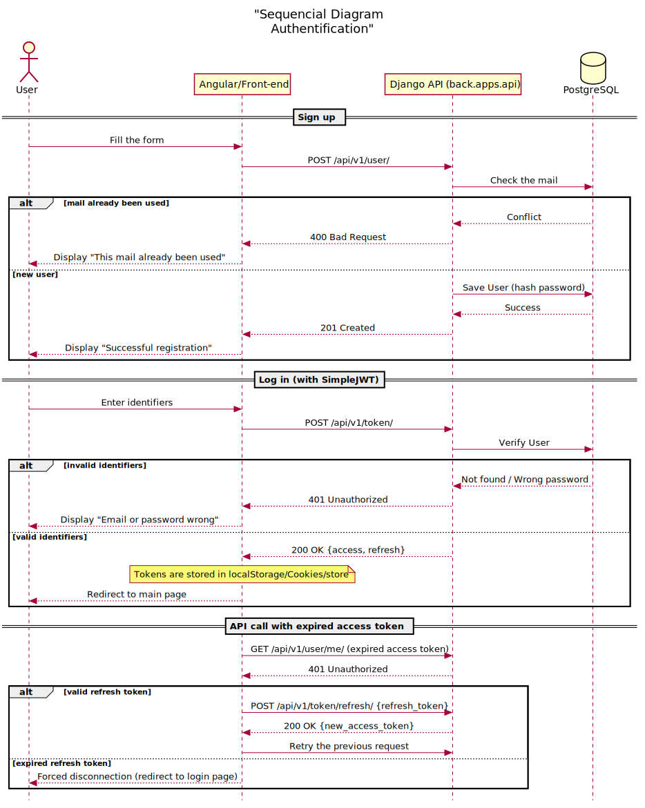

# 1. Plan du Rapport Final

1. **Introduction :** Contexte, présentation du sujet et objectifs.
2. **Analyse et Spécifications :** Cahier des charges, recueil des besoins fonctionnels et non fonctionnels.
3. **Conception :** Architecture système, conception de la base de données.
4. **Réalisation et Choix Techniques :** Justification des packages, implémentation des fonctionnalités clés.
5. **Validation et Tests :** Stratégie de test, correction des bugs.
6. **Bilan de la Gestion de Projet :** Analyse du planning, plan de charge réel contre prévisionnel, difficultés rencontrées.
7. **Conclusion et Perspectives.**

---

\newpage

# 2. Cahier des charges

## 2.1. Description du sujet

Jusqu'alors, l'association INTech du campus Tsp-Imtbs rencontrait des difficultées de gestion des impressions 3D.
En effet, lorsqu'une personne veut faire une impression, elle doit demander à un membre de l'association qui annote alors sur un fichier Excel le nom de la dite personne.
C'est une tâche chronophage et manuelle qui implique des erreurs et un pré-paiement des bobines.

Intervient alors le projet PrINTech consistant au développement d'une application web dynamique qui permette une gestion des impressions 3D de manière automatique.

Contrairement aux solutions Excel existantes, ce projet s'inscrit dans une vision long terme avec une scalabilité des fonctionnalitées possible ainsi qu'une sécurité accrue.

## 2.2. Liste des fonctionnalités de l'application
Afin de répondre au sujet, l'application doit intégrer les fonctionnalités suivantes, classées par priorité de développement :

| ID | Fonctionnalité de l'application | Description technique | Priorité |
| :--- | :--- | :--- | :---: |
| **F01** | **Authentification** | Inscription, connexion et déconnexion via Django Auth. | Haute |
| **F02** | **Gestion des Profils** | Affichage et modification des informations utilisateurs. | Haute |
| **F03** | **[Fonctionnalité Métier 1]** | [Ex: Création d'une commande et sauvegarde en base] | Haute |
| **F04** | **[Fonctionnalité Métier 2]** | [Ex: Génération d'une facture au format PDF] | Moyenne |
| **F05** | **Espace Administrateur** | Interface d'administration native Django pour modérer les données. | Basse |

---

\newpage

# 3. Conception Préliminaire
*Conformément au cycle de développement (Cycle en V), cette section valide l'étape de conception préliminaire en traduisant les besoins en architecture technique.*

## 3.1. Base de données

---

\newpage

## 3.2. Séquence de l'Authentification

---